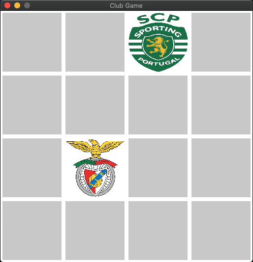

# Football pick game using Python

### Overview

This is a simple game of pick two equal images. The game is developed in Python using the ***Pygame*** lib. 




The implementation required the keyboard and mouse input, and for that, the mentioned library was used. The following is a snippet of this usage.

```
# check pressed keyboard key
if e.type == pygame.KEYDOWN:
    if e.key == pygame.K_ESCAPE:
        running = False
        
# check mouse button pressed
if e.type == pygame.MOUSEBUTTONDOWN:
    # get the index of the clicked tile
        mouse_x, mouse_y = pygame.mouse.get_pos()
        index = find_index (mouse_x, mouse_y)
```

Each major change to the outcome of the game (selecting two identical images, per example) is only visible after the display is flipped with a simple ```display.flip()```

This small project allowed to work with the Pygame lib, deal with input, create an object, reading files, etc. representing a fun overview of some programming fundamentals using Python.


### Run the game

1) Make sure Python3 and Pygame are installed in your machine.
2) On the project dir, run the command ```python3 app.py```. The game display should pop up immediatly and you are able to play it.
3) Have fun

NOTE: To stop the game withou finishing it, close the tab or press "ESC".


### Additional information

The implementation was based on the Coursera course "Create Your First Game with Python" (https://www.coursera.org/projects/python-game?)

The images used are of portuguese football teams and the current project has no commercial purpose of any kind.